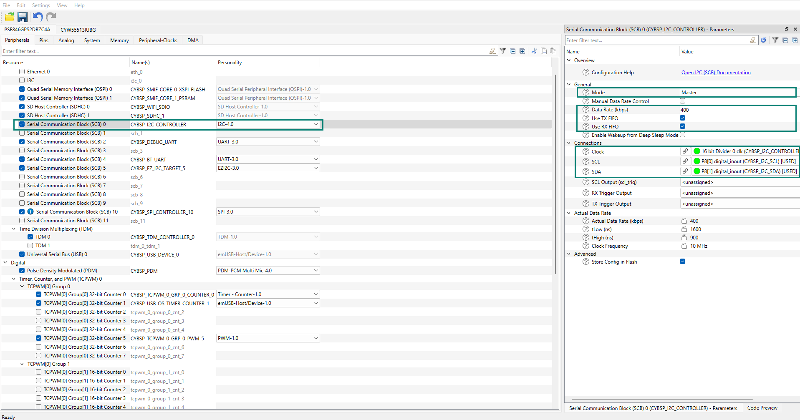

# ILI2511 capacitive touch panel driver library for ModusToolbox&trade;

## Overview

This library provides functions to support Capacitive Touch Panel (CTP) of 10.1 inch TFT LCD [WF101JTYAHMNB0](https://www.winstar.com.tw/products/tft-lcd/ips-tft/ips-touch.html) driven by [ILI2511](https://www.crystalfontz.com/controllers/datasheet-viewer.php?id=487) controller. This 1024 x 600 pixel display panel is used with PSOC&trade; Edge E8 Evaluation Kit.

## Quick start

Follow these steps to add the driver in an application for PSOC&trade; Edge E8x Kit.

1. Create a [PSOC&trade; Edge MCU: Empty application](https://github.com/Infineon/mtb-example-psoc-edge-empty-app) by following "Create a new application" section in [AN235935 – Getting started with PSOC&trade; Edge E8 on ModusToolbox&trade; software](https://www.infineon.com/AN235935) application note

2. Add the *touch-ctp-ili2511* library to this application using Library Manager

3. Use Device Configurator to configure Serial Communication Block (SCB) as an I2C interface for the touch driver in the application as follows:

   - Enable Serial Communication Block (SCB)`resource and configure the same for ILI2511 as shown in **Figure 1**
      
     **Figure 1. SCB I2C master configuration**
      
     

4. Save the modified configuration(s) in Device Configurator

5. Use the driver APIs in the application as shown in the following code snippet:

    ```cpp
    #include "cybsp.h"
    #include "mtb_ctp_ili2511.h"


    /*****************************************************************************
    * Macros
    *****************************************************************************/
    /* Configure the following GPIO pins per board schematics in the
    * Device Configurator. 
    * The values provided here serve as an example from driver API usage
    * perspective.
    */
    #define CTP_RESET_PORT       GPIO_PRT17
    #define CTP_RESET_PIN        (3U)
    #define CTP_IRQ_PORT         GPIO_PRT17
    #define CTP_IRQ_PIN          (2U)


    /*****************************************************************************
    * Global variable(s)
    *****************************************************************************/
    cy_stc_scb_i2c_context_t i2c_cntxt;

    /* SCB - I2C IRQ configuration. */
    cy_stc_sysint_t i2c_scb_irq_cfg =
    {
        .intrSrc        = CYBSP_I2C_CONTROLLER_IRQ,
        .intrPriority   = 2U
    };

    /* ILI2511 touch controller configuration. */
    mtb_ctp_ili2511_config_t ctp_ili2511_cfg =
    {
        .scb_inst            = CYBSP_I2C_CONTROLLER_HW,
        .i2c_context         = &i2c_cntxt,
        .rst_port            = CTP_RESET_PORT,
        .rst_pin             = CTP_RESET_PIN,
        .irq_port            = CTP_IRQ_PORT,
        .irq_pin             = CTP_IRQ_PIN,
        .irq_num             = ioss_interrupts_gpio_17_IRQn,
        .touch_event         = false,
    };


    /*****************************************************************************
    * Function name: i2c_interrupt_callback
    *****************************************************************************/
    void i2c_interrupt_callback(void)
    {
        Cy_SCB_I2C_Interrupt(CYBSP_I2C_CONTROLLER_HW, &i2c_cntxt);
    }


    /*****************************************************************************
    * Function name: main
    *****************************************************************************/
    int main(void)
    {
        cy_rslt_t result;
        cy_en_scb_i2c_status_t i2c_status;

        /* Initializes the device and board peripherals. */
        result = cybsp_init();
        if (CY_RSLT_SUCCESS != result)
        {
            CY_ASSERT(0);
        }

        /* Enables global interrupts. */
        __enable_irq();

        /* Configures SCB0 as I2C controller. */
        i2c_status = Cy_SCB_I2C_Init(CYBSP_I2C_CONTROLLER_HW, &CYBSP_I2C_CONTROLLER_config, &i2c_cntxt);
        if (CY_SCB_I2C_SUCCESS != i2c_status)
        {
            /* Handles possible errors. */
            CY_ASSERT(0);
        }

        /* Interrupts initialization for SCB block. */
        Cy_SysInt_Init(&i2c_scb_irq_cfg, &i2c_interrupt_callback);
        NVIC_EnableIRQ(i2c_scb_irq_cfg.intrSrc);

        /* Enables I2C. */
        Cy_SCB_I2C_Enable(CYBSP_I2C_CONTROLLER_HW);

        /* Initializes ILI2511 touch driver. */
        result = mtb_ctp_ili2511_init(&ctp_ili2511_cfg);
        if (CY_RSLT_SUCCESS != result)
        {
            /* Handles possible errors. */
            CY_ASSERT(0);
        }

        for (;;)
        {
        }
    }
    ```
    ```cpp
    cy_rslt_t result;
    static int touch_x = 0;
    static int touch_y = 0;

    /* Reads the touch coordinates when a touch event is detected.
    * Invokes this function within the input device read callback registered to
    * the graphics framework or as a callback for the touch interrupt in 
    * a bare metal application.
    */
    if (ctp_ili2511_cfg.touch_event)
    {
        /* Resets the touch detection event once set in the touch IRQ handler. */
        ctp_ili2511_cfg.touch_event = false;

        /* Reads the touch coordinates and takes action based on the UI event. */
        result = mtb_ctp_ili2511_get_single_touch(&touch_x, &touch_y);
        if (CY_RSLT_SUCCESS != result)
        {
            /* Handles possible errors. */
            CY_ASSERT(0);
        }
    }
    ```
    ```cpp
    /* De-initializes the touch driver before releasing all the resources. */
    mtb_ctp_ili2511_deinit();
    ```
    > **Note:** To enable graphics support with the 10.1 inch display, follow the steps outlined in the **Quick start** section of the *display-tft-ek79007ad3* **README** file.

## More information

For more information, see the following documents:

* [API reference guide](./API_reference.md)
* [ModusToolbox&trade; software environment, quick start guide, documentation, and videos](https://www.infineon.com/modustoolbox)
* [AN239191](https://www.infineon.com/AN239191) – Getting started with graphics on PSOC&trade; Edge MCU
* [Infineon Technologies AG](https://www.infineon.com)


---
© 2025, Cypress Semiconductor Corporation (an Infineon company)
